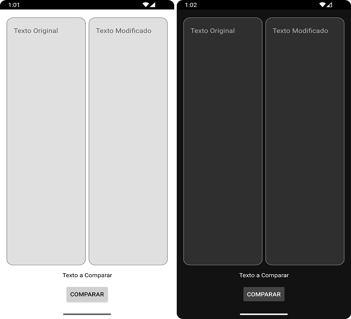

## __Aplicacion Movil Comparador de Texto__
### Argentina Programa 4.0
### Academia Ticmas
### Curso: Desarrollo de Aplicaciones Moviles

### __Aplicacion Modo Claro <=> Aplicacion Modo Oscuro__

### __Consigna__

El __proyecto final__ consiste en desarrollar una __aplicacion para movil__ que comprare entre dos textos si son iguales o diferentes.

#### __Utilizando__

- Dos cuados de Textos (EditText)
- Un boton (Button) con el texto "Comparar"
- Un Texto (TextView)
- Almacenarlo en un __repositorio__ como github.

### __Descripción sobre mi proyecto:__
Armado de una aplicacion movil que compare texto y que muestre si es igual o diferente con Android Studio.

#### __Temas implementados en este proyecto los cuales son:__

- Activities.
- Layout.
- Fragments.
- Manifest.
- Intents.
- Resources.
- Localization.
- Services.
- Local Storage & Databases.
- API REST (HTTP).
- Corrutinas (Async Tasks).
- Content Providers y Resolvers.
- Principios SOLID: SRP, OCP, LSP, ISP, DIP.
- Arquitectura MVVM (Model View ViewModel).
- Sistema de compilación Gradle.
- Fundamentos de Tests.
- Test de ViewModel.
- Test de Activity.
- Publicar una app de prueba en el Play Store.
- Publicar en github.

Fecha limite de entrega 31 de Agosto del 2023

Fecha extendida de entrega 3 de Septiembre del 2023

__Fecha de entrega 2 de Septiembre 2023__